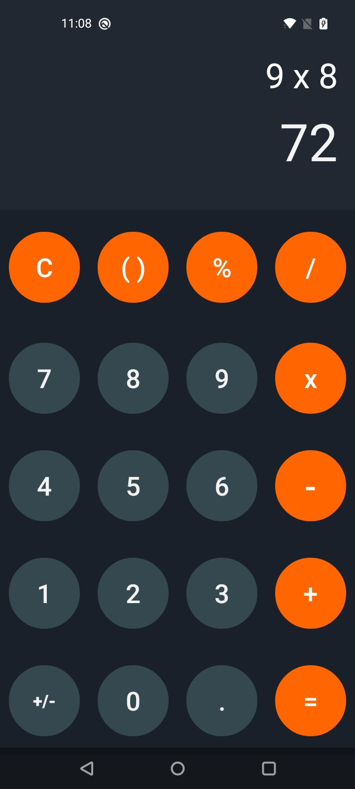

# Calculadora desarrollada en Kotlin

  

Esta aplicación es una calculadora sencilla desarrollada para practicar las habilidades adquiridas en el lenguaje Kotlin

Características: 

Realiza operaciones con números enteros y decimales. 

Realiza operaciones básicas de suma, resta, multiplicación y división. 

Función de limpieza con el botón "C".

pronto se agregarán las funciones restantes

(de momento solo funciona con dos números a la vez como se aprecia en las capturas de pantalla)

